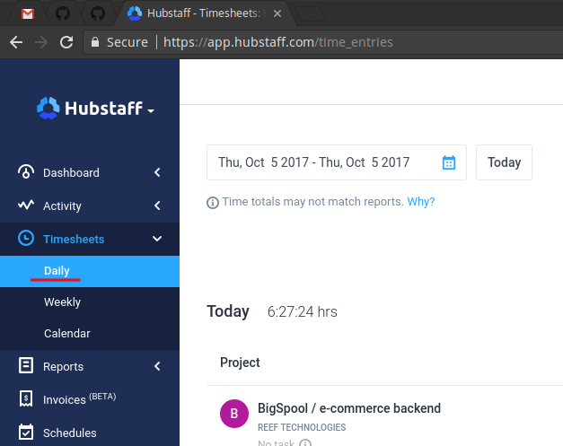
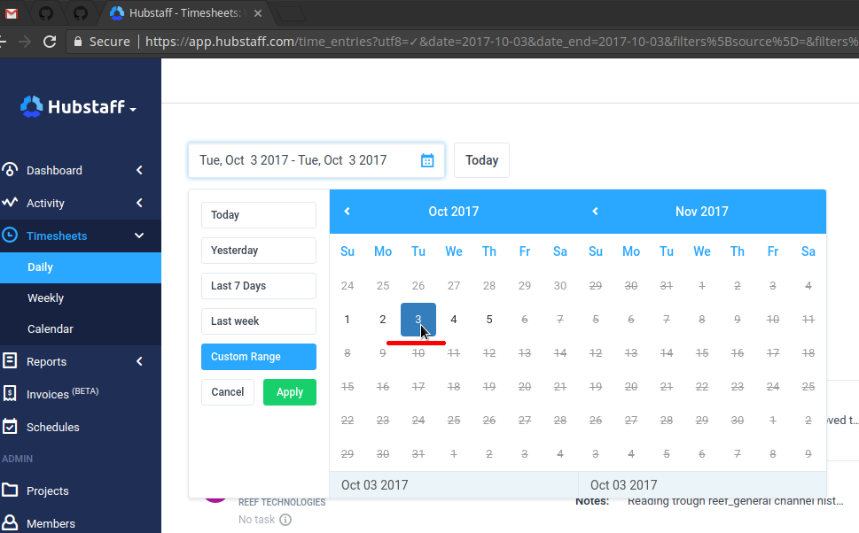
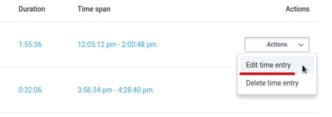
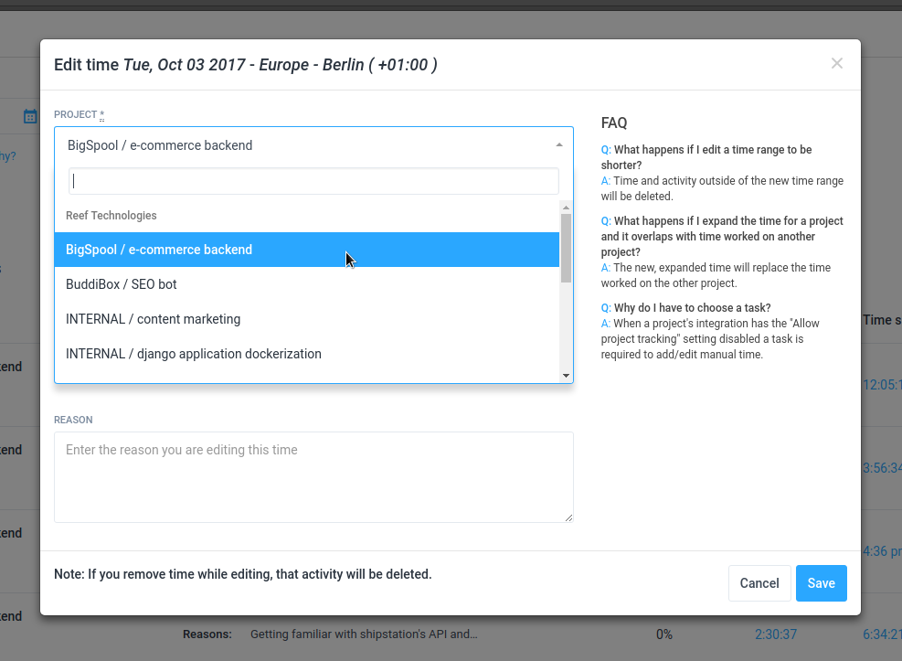
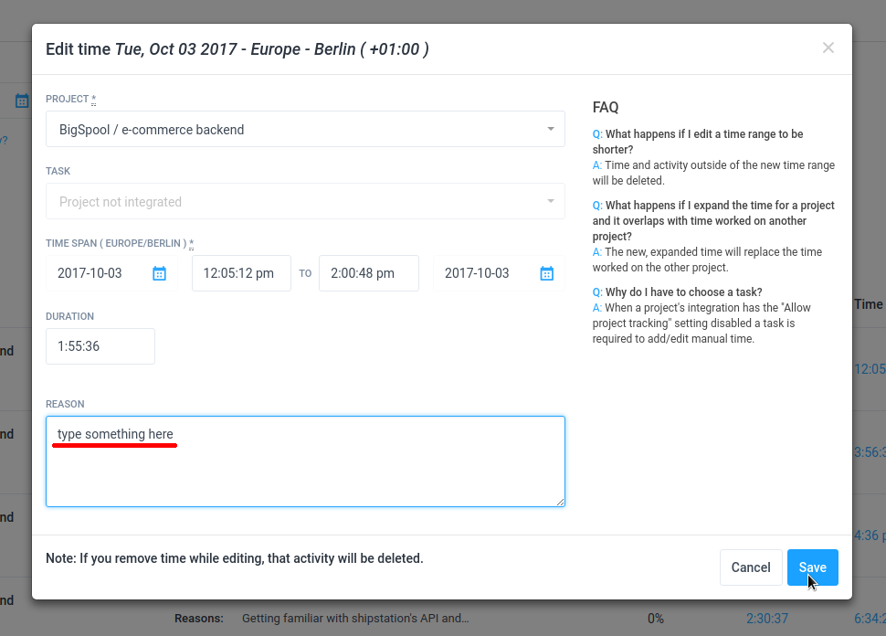

# Hubstaff - how to edit time entry (e.g. change project to bill)?

##### Go to Timesheets > Daily

##### Choose date range (click the same date twice to get time entries for one day)

##### Choose Actions > Edit time entry

##### Choose project that you want to move your time to

##### Fill the reason for your time edit and click Save

