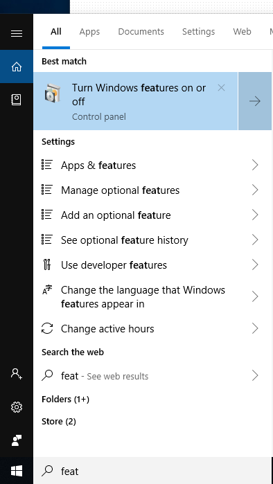
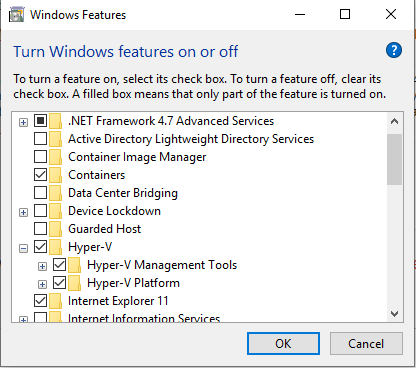
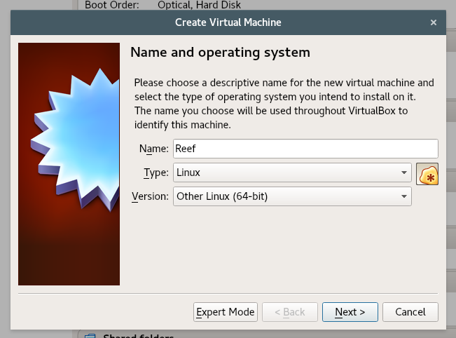
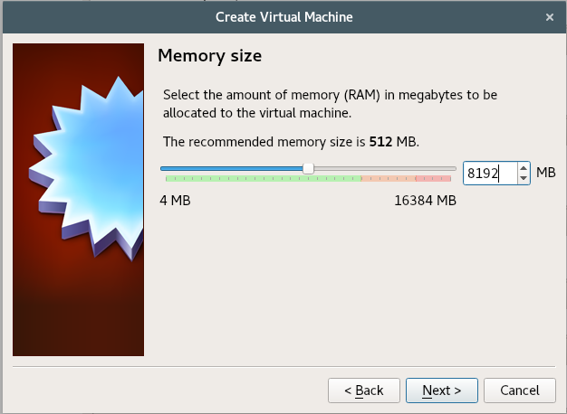
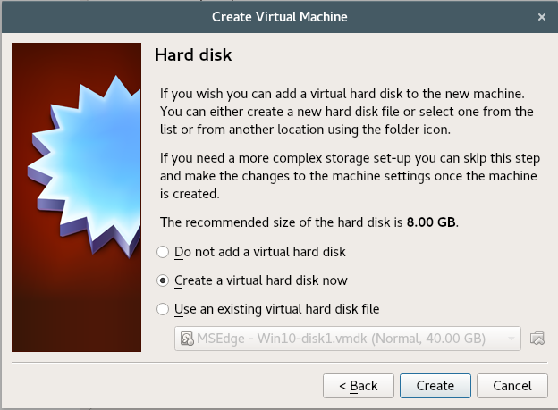
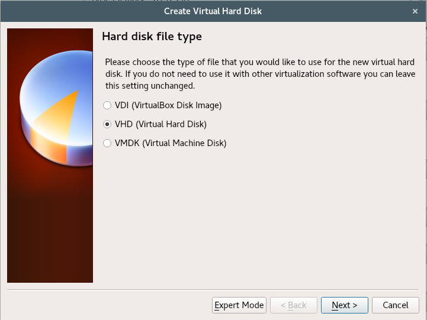
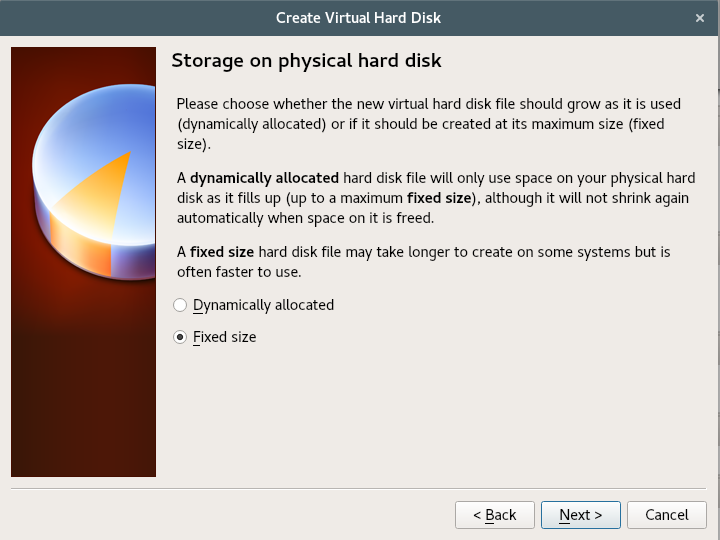
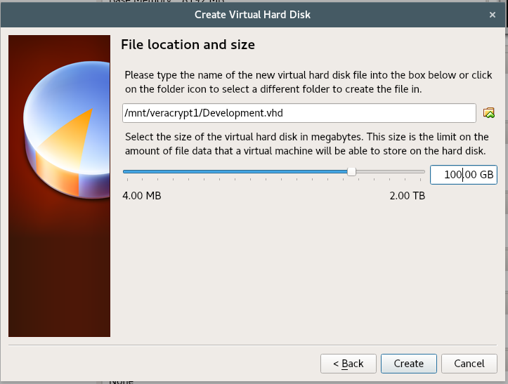
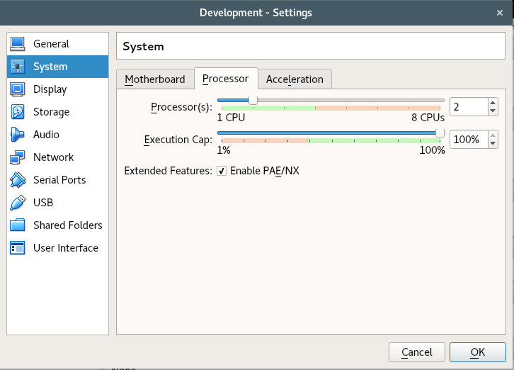
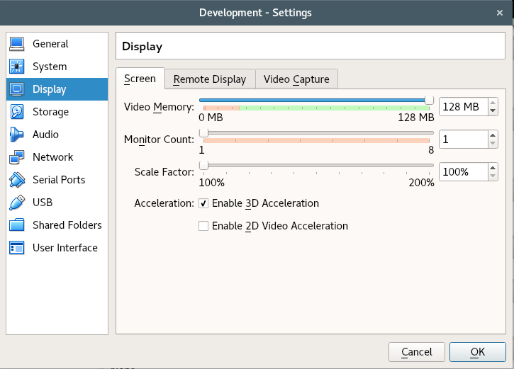

# Virtual machine configuration

**For Windows 10 Pro host:** You will need to disable HyperV

Make sure that **Hyper-V is NOT checked**, so deselect it if it's selected like below.

**Virtual machine configuration**

Note that the virtual machine disk file should reside on the encrypted volume!

Depending on your computer hardware, it is recommended to increase the number of cores used by the virtual machine and memory for graphics:

Guide on resizing linux partitions in case you'd need to grow the device can be found [here](https://www.vultr.com/docs/block-storage#:~:text=Resize%20the%20filesystem%20-%20Linux)
